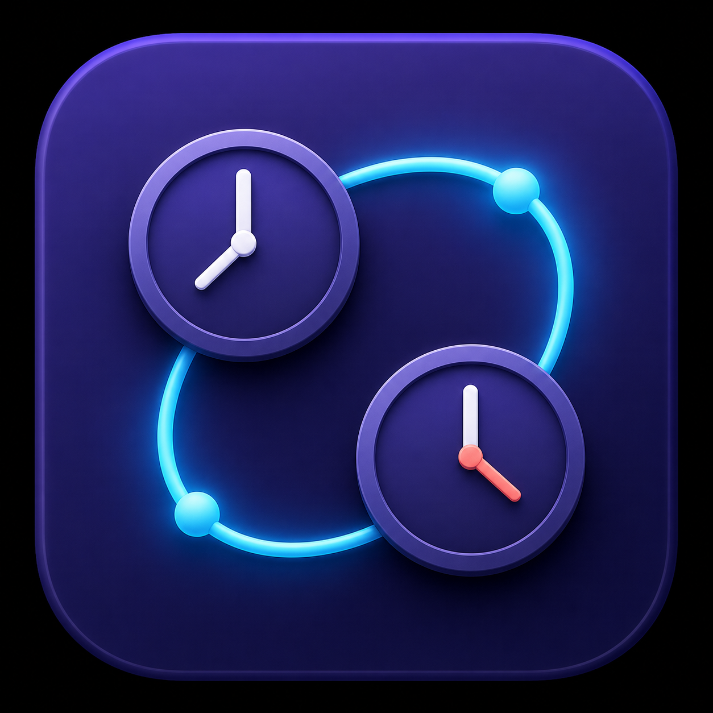

<p align="center">
  
</p>

<h1 align="center">Timezoner</h1>

<p align="center">
  A native macOS menu-bar utility for translating a time or time range across multiple timezones.
</p>

Timezoner keeps one canonical moment or range synchronized across a pinned local-time row and any number of comparison rows. It is designed for quick scheduling checks without opening a calendar or searching for timezone conversions.

## Features

- Edit a 24-hour time directly or drag a five-minute-step timeline handle.
- Add an optional end time to visualize ranges, including ranges that cross midnight.
- Compare the same moment across multiple synchronized timezone rows.
- Keep the device timezone pinned while comparison rows remain scrollable.
- Show a durable live-device-time marker on every configured timeline, with a timezone-adjusted hover label.
- Search a compact timezone catalog by names, abbreviations, UTC/GMT offsets, or numeric values.
- Distinguish seasonal PT, MT, CT, and ET rules from neutral fixed-offset timezones.
- Remember the comparison-row composition while resetting the selected time to the current device time whenever the menu closes.
- Register as a macOS login item and surface when approval is required in System Settings.
- Work entirely on-device with no network service or account.

## Requirements

- macOS 13 Ventura or later
- Xcode 15.3 or later, or a matching Swift 5.10+ command-line toolchain

Timezoner is a menu-bar app (`LSUIElement`) and does not place an icon in the Dock.

## Build and install

Clone the repository and run the packaging script:

```bash
git clone https://github.com/SunFoxx/Timezoner.git
cd Timezoner
./Scripts/build_app.sh
```

The script builds a release executable, assembles `Timezoner.app`, applies an ad-hoc local signature, verifies the bundle, and writes a ZIP archive under `dist/`.

Extract the archive, move `Timezoner.app` into `/Applications`, and open it once. macOS may ask you to approve the app under **System Settings → General → Login Items**.

> The project does not currently publish a Developer ID-signed or notarized binary. The packaging script is intended for local source builds.

## Using Timezoner

1. Open Timezoner from the menu-bar icon. The pinned first row uses the Mac's current timezone and cannot be removed or changed.
2. Enter a start time or drag its handle. Select **+ End** when you need a range.
3. Choose a comparison timezone, then add more rows as needed.
4. Edit any configured row; every other row updates to represent the same absolute moment.
5. Hover the coral live-time strip to reveal the device's current time in that row's timezone.

The comparison rows are persisted in `UserDefaults`. Selected clock values are intentionally refreshed from the current device time after the menu closes.

## Development

The project is a Swift Package with a native SwiftUI/AppKit interface:

- `Sources/TimezonerCore` contains time parsing, timezone conversion, row persistence, and application state.
- `Sources/Timezoner` contains the menu-bar lifecycle and native views.
- `Tests/TimezonerCoreTests` covers state and conversion behavior, including daylight-saving transitions.
- `Tests/TimezonerViewTests` covers mounted layout, live-clock behavior, and viewport geometry.
- `Tests/Acceptance/timezoner.feature` documents the product-level behavior in Gherkin.

Run the automated checks with:

```bash
swift format lint --recursive --strict Sources Tests
swift test
swift build -c release -Xswiftc -strict-concurrency=complete -Xswiftc -warnings-as-errors
```

## Privacy

Timezoner does not send analytics, make network requests, or require an account. The configured comparison rows are stored locally using `UserDefaults`.

## License

No open-source license has been selected yet. All rights are reserved by default.
